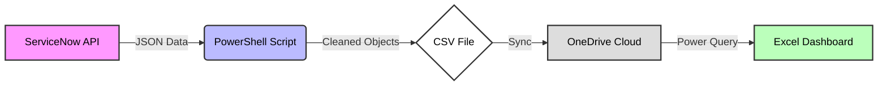

# ServiceNow Hardware Shipping Automation

## Overview
This project automates the extraction of hardware shipping details from ServiceNow and publishes them to a cloud-synced CSV, which feeds into an Excel Online dashboard. 

The system serves as an ETL (Extract, Transform, Load) pipeline built using **PowerShell**, the **ServiceNow REST API**, and **OneDrive**. It acts as a bridge between IT Service Management (ITSM) ticketing data and shipping logistics, eliminating the need for manual data entry.

## The Challenge
In many enterprise IT environments, fulfilling hardware requests involves a manual bottleneck requiring **redundant data entry**. A typical workflow often looks like this:
1.  Opening a ticket in the ITSM tool to access request details.
2.  **Manual Entry 1:** Logging the Ticket Number, User Name, and Device Serial Number into a master asset tracking spreadsheet.
3.  **Manual Entry 2:** Re-typing the User Name and Shipping Address into the label printer software.
4.  Printing and verifying the label against the ticket data.

This manual process is time-consuming (several minutes per ticket) and introduces the risk of human error, such as typos in shipping addresses.

## The Solution
This automation creates a "zero-touch" data flow:
* **Efficiency:** Reduces the process from minutes to seconds.
* **Accuracy:** Removes manual entry entirely, ensuring the address on the label matches the ticket exactly.
* **Visibility:** Provides a live dashboard of pending shipments via Excel Online.

## Business Impact (ROI Estimation)
Based on a deployment in a standard enterprise environment with ~15 support technicians, this automation yields significant productivity gains:

* **Time Saved:** Automating the manual transcription saves ~3 minutes per hardware request.
* **Weekly Impact:** Across a team of 15, this reclaims approximately **3.5 hours of technician time per week**.
* **Annual Value:** At standard labor rates, this equates to roughly **$10,000/year in regained productivity**, allowing staff to focus on complex troubleshooting rather than data entry.

## How It Works

1.  **Extract:** The script connects to the ServiceNow REST API and queries the `sc_req_item` table for active hardware requests.
2.  **Transform:** It extracts specific variables (Requester Name, Street Address, City, Postal Code) and cleans the JSON response to resolve ServiceNow reference objects into readable text.
3.  **Load:** The cleaned data is exported to a CSV file located inside a OneDrive-synced folder.
4.  **Sync:** OneDrive automatically uploads the CSV to the cloud, where an Excel Online dashboard (connected via Power Query) updates the view for the logistics team.

## Components
* **Source:** ServiceNow Personal Developer Instance (PDI)
* **Engine:** PowerShell script (REST API & JSON parsing)
* **Transport:** OneDrive (Local to Cloud sync)
* **Frontend:** Excel Online dashboard

## Script Included
The full ETL script is provided in `Build-ShippingCSV.ps1`.

## Documentation
Full documentation is available under `/docs`.

## Extensibility & Future Roadmap
This framework is designed to be highly configurable. While the current implementation focuses on address extraction, the pipeline can be scaled to handle full-cycle asset management:

* **Automated Label Printing:** The generated CSV structure is compatible with Dymo/Zebra label software. A future enhancement could trigger "One-Click" printing directly to a dedicated shipping station.
* **Full Asset Lifecycle Tracking:** The logic can be expanded to pull granular details such as Device Serial Numbers, Active Directory Usernames, and Onboarding dates.
* **Bidirectional Sync:** The pipeline could be upgraded to **write back** to ServiceNow, automatically updating the ticket status to "Shipped" once the label is generated.
